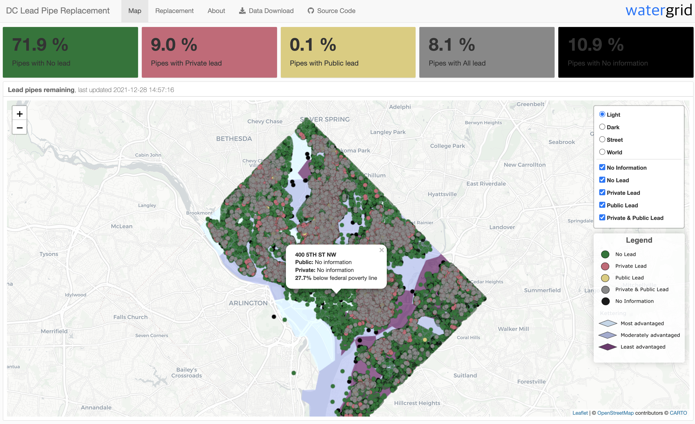

# Open source templates for water system lead mapping & replacement tracking



## Abstract 

> There are an estimated 6-10 million lead service lines across the United States, spread out among 11,000 communities. All of these lead pipes pose a threat to drinking water until they are removed... Municipalities and water utilities across the country are striving to remove toxic lead water pipes and need higher quality resources to identify where they are and communicate about how to address the issue. - [Environmental Policy Innovation Center](https://www.policyinnovation.org/)

In response to the challenges created by toxic lead water pipes, the [2021 Water Data Prize](https://www.waterdataprize.com/) was organized to solicit novel solutions for lead pipe mapping and replacement, effective communication and engagement strategies, and criteria to support equitable replacement. 

Lead pipe replacement efforts are high-visibility, and may be overseen by diverse multi-stakeholder groups composed of water agencies, the public, state officials, nonprofits, and private consultants. As such, they are typically tracked and mapped over time, and this data may be shared on an online portal and via interactive maps. Some agencies have built mapping interfaces to explore and share dataa. However, existing online mapping interfaces are proprietary and hence costly and inaccessible to small to mid-sized agencies. They also do not address issues of equity or enable prioritization of lead pipe replacement for least advantaged groups.

This Github repository contains open-source templates (free to use under the [MIT License](https://github.com/WaterDataLab/lead/blob/main/LICENSE)) for creating interactive, we-based lead service line maps. The MIT license allows anyone to use and modify the code herein for their own purposes, even commercial. This effectively allows the rapid proliferation of low-cost and open-source solutions. Analysts proficient in `R` can adapt any of the 4 templates provided to an area of interest and coordinate with their agency's IT department to publish the static HTML files. [Water Data Lab LCC](waterdatalab.com) developed these templates and offers implementation consulting services for data management, processing, and web-hosting on a time and materials basis and via the microservice [Watergrid](watergrid.io). Because the templates are already developed and made with free, open-source software, projects costs are dramatically reduced.


## Problem

Agencies need web-based tools to map lead pipes and track replacement efforts. Existing effective solutions exist (e.g., [DC Water example](https://geo.dcwater.com/Lead/)), however they:  

- **are expensive**: current solutions are built with ArcGIS web tools which are proprietary, costly, and offer limited customization. Moreover, custom tools to track replacement efforts are missing, and real-time updates to these data are costly if relying on re-contracting consultants or manually updating Arc storyboards.   
- **lack an equity lens**: current solutions do not use equity metrics (e.g., household income from Census data) to prioritize the least advantaged areas for line replacement and communication. This is especially important in communities subject to historical injustice. 
- **may not address public concerns**: current solutions lack highly customizable public communication pages that empathize with and speak to customers in a service area.  


## Solution

We present a solution that is:  

- **affordable**: the open-source templates herein are free for immediate use under the MIT license. Water systems may directly implement, or work with consultants to use existing designs without developing them from scratch, thereby saving budget to focus on implementation. Moreover, code-based solutions enable both highly customizable displays as communication needs evolve, and automated update [microservices](watergrid.io) provide immediate results to dramatically reduce overall project maintenance and update costs over a multi-year project.    
- **socially-just**: the templates herein visualize income groups based on Census data, and allow easy data export to prioritize replacement effort by economic need. They allow users to track replacement actions across the system over time and measure equitable effort across income groups (e.g., similar to how some COVID safety measures did not allow a county to move up a "safety tier"" if COVID rates in the lowest income group were 10% more than in the highest income group). 
- **empathetic and tailored to the local community**: the templates herein provide a flexible, customizable canvas for an evolving public communication strategy across different water systems.  


## Templates

We use the Washington, DC lead [data](https://www.dcwater.com/service-line-materials-dashboard) and [mapping template](https://geo.dcwater.com/Lead/) to build the examples in this repository. 

Four mapping templates are provided in this repo, with live demos here:

- [Template 1a](https://watergrid.io/lead1a/)   
- [Template 1b](https://watergrid.io/lead1b/)   
- [Template 2a](https://watergrid.io/lead2a/)   
- [Template 2b](https://watergrid.io/lead2b/)   

Template 1 ports over the DC Water grey/green color scheme. Template 2 uses a colorblind-safe palette to distinguish between different lead conditions, adds in equity information, and summarizes key statistics on lead pipe composition and equity.

Templates ending in "a" do not track replacement efforts (in a "Replacement" tab). Templates ending in "b" have a "Replacement" tab that can be customized to report on how various lead pipe statistics change over time and as replacement efforts proceed.


## Getting started

Clone this repo, and open the RProject, `lead.Rproj`. Open one of the 4 `template{x}.Rmd` files and knit the file. This generates the html map and dashboard for DC lead data as a static HTML file.  

Ensure you have R >= 4.1.0 installed. 

Install packages required for this project:

```
pkgs <- c("flexdashboard", "leaflet", "tidyverse", "leafgl", "sf")
install.packages(pkgs)
```

For more detailed R and package installation support, see [this guide](https://www.r4wrds.com/intro/m_install_r). 

Adapt the dashboard to your own needs with a custom data source.


## More information

Key R packages used in this project:

- [flexdashboard](https://pkgs.rstudio.com/flexdashboard/index.html)  
- [leaflet](https://rstudio.github.io/leaflet/)  
- [leafgl](https://github.com/r-spatial/leafgl)  

```
> sessionInfo()
R version 4.1.0 (2021-05-18)
Platform: x86_64-apple-darwin17.0 (64-bit)
Running under: macOS Catalina 10.15.7

Matrix products: default
BLAS:   /System/Library/Frameworks/Accelerate.framework/Versions/A/Frameworks/vecLib.framework/Versions/A/libBLAS.dylib
LAPACK: /Library/Frameworks/R.framework/Versions/4.1/Resources/lib/libRlapack.dylib

locale:
[1] en_US.UTF-8/en_US.UTF-8/en_US.UTF-8/C/en_US.UTF-8/en_US.UTF-8

attached base packages:
[1] stats     graphics  grDevices utils     datasets  methods   base     

other attached packages:
 [1] leafgl_0.1.1        sf_1.0-4            forcats_0.5.1       stringr_1.4.0      
 [5] dplyr_1.0.7         purrr_0.3.4         readr_2.1.0         tidyr_1.1.4        
 [9] tibble_3.1.6        ggplot2_3.3.5       tidyverse_1.3.1     leaflet_2.0.4.1    
[13] flexdashboard_0.5.2

loaded via a namespace (and not attached):
 [1] Rcpp_1.0.7           lubridate_1.8.0      class_7.3-19         assertthat_0.2.1    
 [5] digest_0.6.28        utf8_1.2.2           R6_2.5.1             cellranger_1.1.0    
 [9] backports_1.3.0      leaflet.extras_1.0.0 reprex_2.0.1         e1071_1.7-9         
[13] evaluate_0.14        httr_1.4.2           pillar_1.6.4         rlang_0.4.12        
[17] readxl_1.3.1         rstudioapi_0.13      rmarkdown_2.11       htmlwidgets_1.5.4   
[21] munsell_0.5.0        proxy_0.4-26         broom_0.7.10         compiler_4.1.0      
[25] modelr_0.1.8         janitor_2.1.0        xfun_0.28            pkgconfig_2.0.3     
[29] htmltools_0.5.2      tidyselect_1.1.1     fansi_0.5.0          crayon_1.4.2        
[33] tzdb_0.2.0           dbplyr_2.1.1         withr_2.4.2          grid_4.1.0          
[37] jsonlite_1.7.2       gtable_0.3.0         lifecycle_1.0.1      DBI_1.1.1           
[41] magrittr_2.0.1       units_0.7-2          scales_1.1.1         KernSmooth_2.23-20  
[45] cli_3.1.0            stringi_1.7.5        fs_1.5.0             snakecase_0.11.0    
[49] xml2_1.3.2           ellipsis_0.3.2       generics_0.1.1       vctrs_0.3.8         
[53] tools_4.1.0          glue_1.5.0           hms_1.1.1            crosstalk_1.2.0     
[57] fastmap_1.1.0        colorspace_2.0-2     classInt_0.4-3       rvest_1.0.2         
[61] knitr_1.36           haven_2.4.3         
```
